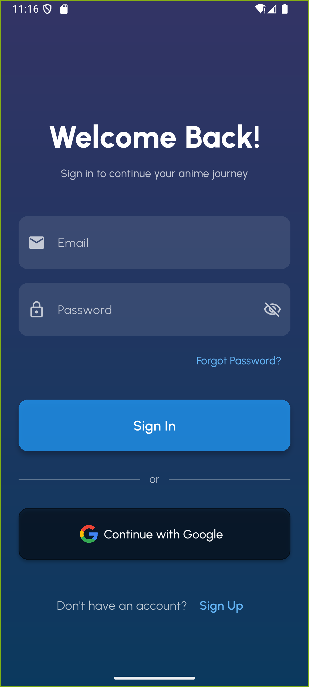
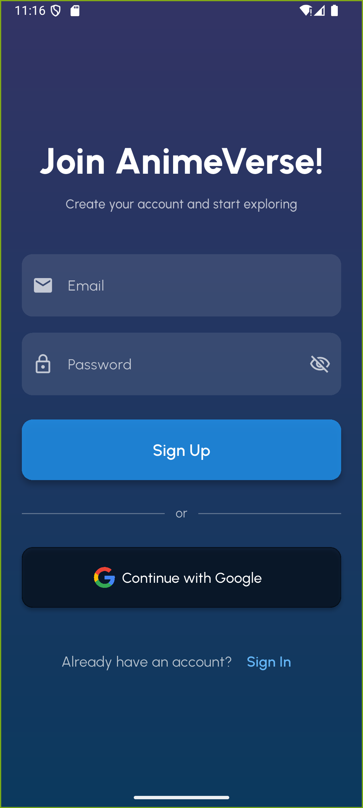
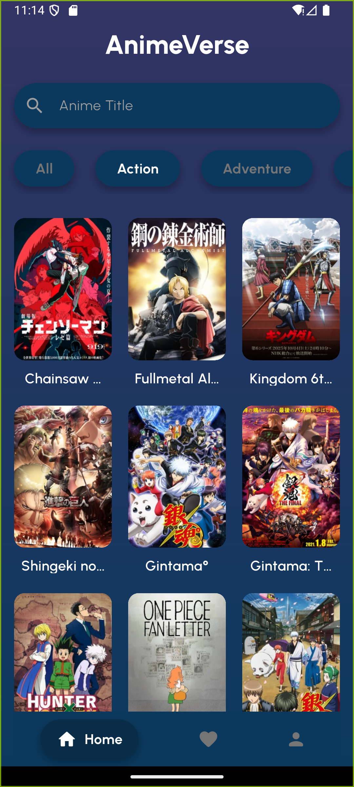
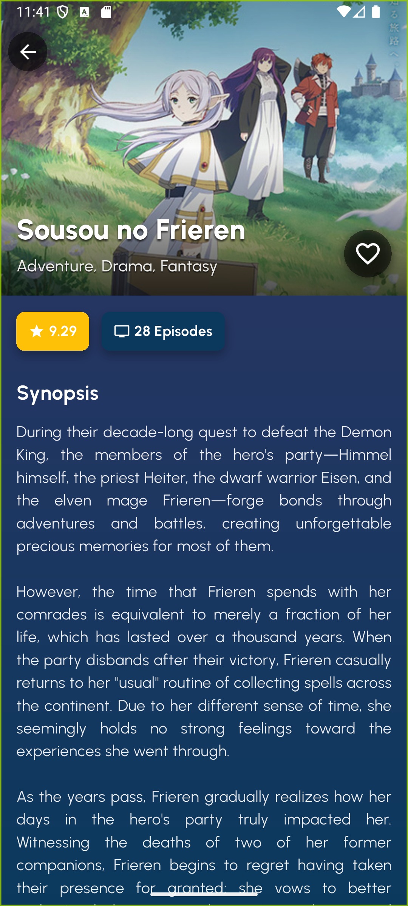
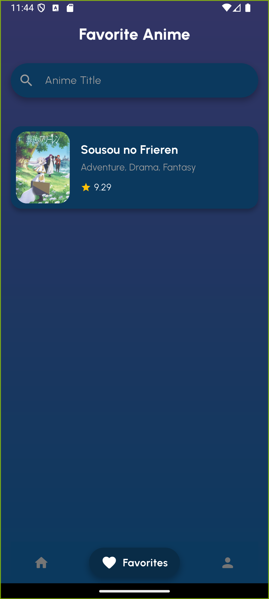
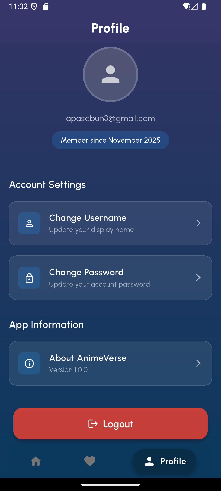

# 🎌 AnimeVerse

**Nama:** Higen Putra Perangin Angin  
**NIM:** 211401108

---

**AnimeVerse** adalah aplikasi mobile berbasis Flutter untuk menjelajahi dan mengelola katalog anime favorit Anda. Aplikasi ini memanfaatkan [Jikan API](https://jikan.moe) untuk menyediakan data anime yang lengkap dan terpercaya.


## 📱 Fitur Utama

### ✨ Fitur Inti
- **🏠 Home Screen** - Jelajahi anime populer dengan pagination otomatis
- **🔍 Pencarian Anime** - Cari anime berdasarkan judul dengan debounce search
- **🎭 Filter Genre** - Filter anime berdasarkan genre favorit
- **⭐ Favorit** - Simpan anime favorit dengan penyimpanan lokal (SharedPreferences)
- **📖 Detail Anime** - Lihat informasi lengkap setiap anime termasuk sinopsis, rating, dan episode
- **👤 Profil Pengguna** - Kelola profil dan preferensi akun

### 🔐 Autentikasi
- **Email & Password** - Daftar dan masuk menggunakan email
- **Google Sign-In** - Masuk cepat menggunakan akun Google
- **Firebase Authentication** - Autentikasi aman dengan Firebase

### 🎨 UI/UX
- **Modern Design** - UI yang elegan dengan gradient background
- **Responsive Layout** - Dapat diadaptasi untuk berbagai ukuran layar
- **Dark Theme** - Tema gelap yang nyaman untuk mata
- **Custom Fonts** - Menggunakan font Urbanist untuk tampilan yang modern
- **Smooth Animations** - Transisi yang halus dan interaktif

## 🛠️ Teknologi yang Digunakan

### Framework & Language
- **Flutter** (SDK 3.9.0+) - Framework UI cross-platform
- **Dart** - Bahasa pemrograman

### State Management
- **Provider** - State management pattern

### Backend & Services
- **Firebase Core** - Integrasi Firebase
- **Firebase Auth** - Autentikasi pengguna
- **Google Sign-In** - OAuth dengan Google

### API & Data
- **Jikan API** - REST API untuk data anime (https://api.jikan.moe/v4)
- **HTTP** - HTTP client untuk API calls

### Storage & Caching
- **SharedPreferences** - Penyimpanan lokal untuk data favorit
- **Cached Network Image** - Caching gambar untuk performa optimal

### Navigation & Routing
- **GoRouter** - Declarative routing untuk Flutter

### Utilities
- **Flutter SVG** - Render SVG images
- **Flutter Native Splash** - Splash screen customization
- **Flutter Launcher Icons** - Custom app icons

## 📋 Persyaratan Sistem

### Untuk Pengembangan
- **Flutter SDK** 3.9.0 atau lebih tinggi
- **Dart SDK** 3.9.0 atau lebih tinggi
- **Android Studio** / **VS Code** dengan ekstensi Flutter
- **Android SDK** (untuk Android development)
- **Xcode** (untuk iOS development, hanya macOS)

### Untuk Aplikasi
- **Android** 5.0 (API 21) atau lebih tinggi
- **iOS** 11.0 atau lebih tinggi (jika dikonfigurasi)

## 🚀 Instalasi & Setup

### 1. Clone Repository
```bash
git clone https://github.com/username/IKLC-anime-verse-main.git
cd IKLC-anime-verse-main
```

### 2. Install Dependencies
```bash
flutter pub get
```

### 3. Konfigurasi Firebase

#### Android
1. Buat project Firebase di [Firebase Console](https://console.firebase.google.com/)
2. Tambahkan aplikasi Android ke project Firebase
3. Download file `google-services.json`
4. Tempatkan file tersebut di `android/app/google-services.json`

#### iOS (Opsional)
1. Tambahkan aplikasi iOS ke project Firebase
2. Download file `GoogleService-Info.plist`
3. Tambahkan file tersebut ke `ios/Runner/` melalui Xcode

### 4. Generate Icons & Splash Screen
```bash
# Generate app icons
flutter pub run flutter_launcher_icons

# Generate splash screen
flutter pub run flutter_native_splash:create
```

### 5. Run Aplikasi
```bash
# Untuk Android
flutter run

# Untuk iOS (hanya macOS)
flutter run -d ios

# Untuk Web
flutter run -d chrome
```

### 📦 Download APK (Pre-built)

Untuk pengguna yang ingin langsung menggunakan aplikasi tanpa build dari source code, Anda bisa download APK release versi **1.0.0**:

**📥 [Download AnimeVerse v1.0.0 APK](release/anime_verse-1.0.0.apk)**

**Cara Install:**
1. Download file `anime_verse-1.0.0.apk` dari folder `release/`
2. Aktifkan **"Install from Unknown Sources"** di pengaturan Android Anda
3. Buka file APK yang sudah didownload
4. Ikuti instruksi instalasi

**Catatan:**
- Pastikan perangkat Android Anda menggunakan Android 5.0 (API 21) atau lebih tinggi
- File APK ini sudah di-sign dan siap untuk diinstall
- Versi: **1.0.0+1**

## 📁 Struktur Proyek

```
lib/
├── config/
│   └── routes.dart          # Konfigurasi routing aplikasi
├── models/
│   └── anime.dart           # Model data anime
├── provider/
│   └── app_state_provider.dart  # State management untuk anime & favorit
├── providers/
│   └── auth_provider.dart   # State management untuk autentikasi
├── repositories/
│   └── anime_repository.dart    # Layer untuk API calls
├── screens/
│   ├── detail_screen.dart   # Halaman detail anime
│   ├── favorite_screen.dart # Halaman anime favorit
│   ├── home_screen.dart     # Halaman utama
│   ├── profile_screen.dart  # Halaman profil
│   ├── signin_screen.dart   # Halaman masuk
│   └── signup_screen.dart   # Halaman daftar
├── services/
│   └── auth/
│       └── auth_service.dart    # Service untuk autentikasi Firebase
├── utils/
│   ├── snackbar_helper.dart # Helper untuk menampilkan snackbar
│   └── validators.dart      # Validasi form input
├── widgets/
│   ├── anime_card.dart      # Widget kartu anime
│   ├── anime_view.dart      # Widget tampilan grid anime
│   ├── app_scaffold.dart    # Scaffold dengan gradient background
│   ├── bottom_navigation_shell.dart  # Bottom navigation bar
│   ├── favorite_anime_card.dart     # Widget kartu favorit
│   ├── genre_list.dart      # Widget filter genre
│   ├── gradient_background.dart     # Widget background gradient
│   ├── profile_button.dart  # Widget tombol profil
│   └── firebase_options.dart        # Konfigurasi Firebase
└── main.dart                # Entry point aplikasi
```

## 🎯 Fitur Detail

### Home Screen
- Menampilkan daftar anime populer dari Jikan API
- Infinite scroll dengan pagination otomatis
- Pencarian real-time dengan debounce (800ms)
- Filter berdasarkan genre
- Pull-to-refresh untuk update data

### Detail Screen
- Informasi lengkap anime (judul, genre, rating, sinopsis)
- Gambar poster dengan efek parallax
- Tombol favorit untuk menyimpan/hapus dari favorit
- Responsive layout dengan sliver app bar

### Favorite Screen
- Daftar semua anime yang disimpan sebagai favorit
- Pencarian dalam daftar favorit
- Penyimpanan lokal (persisten setelah restart app)
- Empty state yang informatif

### Profile Screen
- Informasi pengguna dari Firebase Auth
- Pengaturan akun (update nama, password)
- Logout functionality

## 🔧 Konfigurasi

### Environment Variables
Pastikan file `google-services.json` (Android) atau `GoogleService-Info.plist` (iOS) sudah dikonfigurasi dengan benar untuk Firebase Authentication.

### API Configuration
Aplikasi menggunakan Jikan API yang bersifat public. Tidak ada API key yang diperlukan. Rate limit default adalah 3 requests per detik.

## 📱 Screenshots

Berikut adalah tampilan berbagai halaman dalam aplikasi AnimeVerse:

### 🔐 Halaman Login (Sign In)



Halaman login memungkinkan pengguna untuk masuk ke aplikasi menggunakan:
- **Email dan Password** - Login dengan akun yang sudah terdaftar
- **Google Sign-In** - Login cepat menggunakan akun Google
- **Link ke Sign Up** - Bagi pengguna yang belum memiliki akun

Tampilan dirancang dengan tema dark blue yang elegan dan user-friendly.

---

### 📝 Halaman Registrasi (Sign Up)



Halaman registrasi untuk membuat akun baru:
- Form registrasi dengan validasi email dan password
- Opsi untuk daftar menggunakan Email/Password
- Opsi Google Sign-In untuk pendaftaran cepat
- Link kembali ke halaman login

---

### 🏠 Halaman Home



Halaman utama aplikasi menampilkan:
- **Bar Pencarian** - Cari anime berdasarkan judul dengan real-time search
- **Filter Genre** - Filter anime berdasarkan genre (Action, Comedy, Drama, dll)
- **Grid Anime** - Tampilan grid kartu anime dengan poster, judul, dan rating
- **Infinite Scroll** - Scroll otomatis untuk memuat lebih banyak anime
- **Pull to Refresh** - Refresh data dengan menarik layar ke bawah

Setiap kartu anime menampilkan poster, judul, genre, dan rating untuk membantu pengguna menemukan anime yang menarik.

---

### 📖 Halaman Detail Anime



Halaman detail anime menampilkan informasi lengkap tentang anime yang dipilih:
- **Header Image** - Poster besar anime dengan efek parallax scrolling
- **Judul & Genre** - Informasi utama anime ditampilkan di header
- **Tombol Favorit** - Tambah atau hapus anime dari daftar favorit
- **Rating & Episode** - Rating bintang dan jumlah total episode
- **Sinopsis** - Deskripsi lengkap tentang cerita anime
- **Back Navigation** - Kembali ke halaman sebelumnya dengan mudah

Halaman ini memberikan pengalaman yang imersif untuk menjelajahi detail setiap anime sebelum menambahkannya ke favorit.

---

### ⭐ Halaman Favorit



Halaman untuk melihat dan mengelola anime favorit:
- **Daftar Favorit** - Semua anime yang telah disimpan sebagai favorit
- **Pencarian Favorit** - Cari anime favorit berdasarkan judul
- **Penyimpanan Lokal** - Data favorit tersimpan secara lokal dan persisten
- **Empty State** - Pesan informatif jika belum ada favorit

Pengguna dapat dengan mudah mengakses anime favorit mereka kapan saja tanpa perlu mencari ulang.

---

### 👤 Halaman Profile



Halaman profil pengguna menampilkan:
- **Informasi Akun** - Email dan nama pengguna dari Firebase Auth
- **Pengaturan Akun** - Update nama dan password
- **Logout** - Keluar dari akun dengan aman
- **Tema Aplikasi** - Informasi tentang aplikasi dan versi

Halaman ini memungkinkan pengguna untuk mengelola profil dan preferensi akun mereka.


1. Fork repository ini
2. Buat branch fitur (`git checkout -b feature/AmazingFeature`)
3. Commit perubahan Anda (`git commit -m 'Add some AmazingFeature'`)
4. Push ke branch (`git push origin feature/AmazingFeature`)
5. Buka Pull Request

## 📝 Lisensi

Proyek ini menggunakan lisensi MIT. Lihat file `LICENSE` untuk detail lebih lanjut.

## 🙏 Acknowledgments

- [Jikan API](https://jikan.moe) - Untuk menyediakan data anime yang lengkap dan gratis
- [Flutter Team](https://flutter.dev) - Framework yang luar biasa
- [Firebase](https://firebase.google.com) - Backend services
- Urbanist Font - Font modern yang digunakan dalam aplikasi

## 📧 Kontak

Jika Anda memiliki pertanyaan atau saran, silakan buat issue di repository ini.

---

**Dibuat dengan ❤️ menggunakan Flutter**
